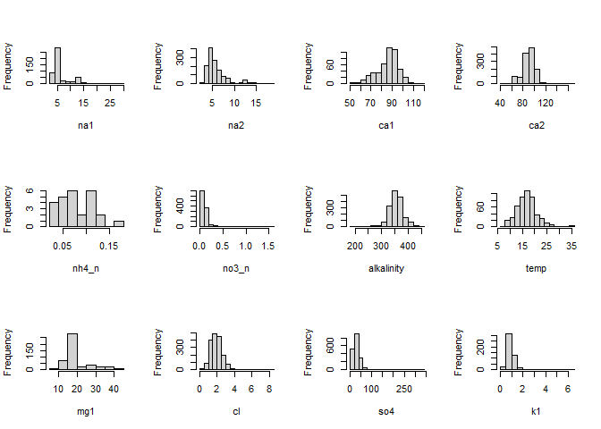
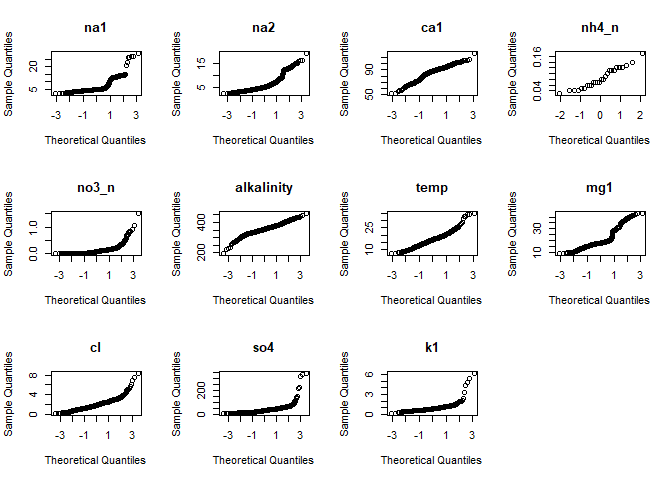

R Project: Konza groundwater analysis; analysis of storage and surface
flow intermittency
================
Christopher Wheeler

## Prepare the R environment

We will load any relevant packages and set the default for our code
visibility in the final report.

``` r
knitr::opts_chunk$set(echo = TRUE)
library(zoo)
library(lubridate)
library(ggplot2)
library(plotly)
library(cowplot)
library(fs)
library(Rcpp)
library(sp)
library(raster)
library(rgdal)
library(rasterVis)
library(sf)
library(tidyverse)
library(dplyr)
library(dataRetrieval)
library(cowplot)
library(reshape2)
library(magrittr)
library(tidyr)
library(readxl)
library(janitor)
library(EnvStats)
library(fs)
```

## Konza Praire LTER Overview

Konza Prairie Biological Station (Konza) was designated as a Long-term
Ecological Research Site (LTER) by NSF in 1981. In the 1990s, Dr. Gwen
Macpherson coordinated the installation of multiple wells in the N04D
watershed at Konza. All that historical groundwater data is accessible
via the Konza Long-term Ecological Research Site webpage. Data include
GWL measurements, as well as water quality data for many analytes This
data I am going to analyze come from one of the many subwatersheds known
as N04D. This watershed is grazed by bison for most of the year, and is
subject to a controlled burn very four years. We will begin by looking
at groundwater chemisty, then move to an examination of how well levels
and storage are related to intermittency in surface flow. The subsurface
geology at konza consists of a series of thinly interbedded limestones
and mudstones, with water movement largely within secondary porosity of
the limestone layers. Below is a map of the entire site for context.

``` r
# Bring in `konza_boundary` shapefiles
konza_boundary <- st_read(
  "GIS002/GIS002.shp")
```

    ## Reading layer `GIS002' from data source 
    ##   `C:\Users\cwhee\Desktop\R_Directory\R_course_project\GIS002\GIS002.shp' 
    ##   using driver `ESRI Shapefile'
    ## Simple feature collection with 1 feature and 8 fields
    ## Geometry type: POLYGON
    ## Dimension:     XY
    ## Bounding box:  xmin: 706198.9 ymin: 4326829 xmax: 712910.3 ymax: 4334740
    ## Projected CRS: NAD83 / UTM zone 14N

``` r
#Bring in `konza_streams` shapefile
konza_streams <- st_read(
  "GIS210/GIS210.shp")
```

    ## Reading layer `GIS210' from data source 
    ##   `C:\Users\cwhee\Desktop\R_Directory\R_course_project\GIS210\GIS210.shp' 
    ##   using driver `ESRI Shapefile'
    ## Simple feature collection with 96 features and 4 fields
    ## Geometry type: LINESTRING
    ## Dimension:     XY
    ## Bounding box:  xmin: 706268.8 ymin: 4326846 xmax: 712897.1 ymax: 4334446
    ## Projected CRS: NAD83 / UTM zone 14N

``` r
ggplot() + 
  geom_sf(data = konza_boundary) + 
  geom_sf(data = konza_streams, color = "blue") + 
  theme_cowplot() +
  ggtitle("Konza Site Map") + 
  xlab("Longitude") + 
  ylab("Latitude") + 
  theme(plot.title = element_text(hjust = 0.5))
```

<!-- -->

## Data Tidying and First Look

In this section, we will perform some basic data cleaning operations to
get our data ready for further analysis

``` r
# bring in and examine konza groundwater data set
kgw <- read_csv("kgw.csv", col_types = cols(WLDate = col_character()))
head(kgw)
```

    ## # A tibble: 6 x 36
    ##   DATACODE RECTYPE Location Trans  Plot Geology Recyear WLDate  Elevation SWDate
    ##   <chr>      <dbl> <chr>    <dbl> <dbl> <chr>     <dbl> <chr>   <chr>     <chr> 
    ## 1 AGW01          1 1-1AL        1     1 AL         1990 1990-0~ 364.47    na    
    ## 2 AGW01          1 2-1Mor       2     1 Mor        1990 1990-0~ 365.44    na    
    ## 3 AGW01          1 2-4Mor       2     4 Mor        1990 1990-0~ 365.28    na    
    ## 4 AGW01          1 2-5Mor       2     5 Mor        1990 1990-0~ 365.18    na    
    ## 5 AGW01          1 2-6Mor       2     6 Mor        1990 1990-0~ 365.26    na    
    ## 6 AGW01          1 3-3Eis       3     3 Eis        1990 1990-0~ 371.87    na    
    ## # ... with 26 more variables: Na1 <chr>, Na2 <chr>, K1 <chr>, K2 <chr>,
    ## #   Li <chr>, NH4_N <chr>, Ca1 <chr>, Ca2 <chr>, Mg1 <chr>, Mg2 <chr>,
    ## #   Sr <chr>, Ba <chr>, SO4 <chr>, F <chr>, Cl <chr>, NO3_N <chr>,
    ## #   HPO4_P <chr>, Alkalinity <chr>, pH1 <chr>, DDB <chr>, pH2 <chr>,
    ## #   Temp <chr>, Si1 <chr>, Si2 <chr>, B <chr>, Conduct <chr>

``` r
names(kgw)
```

    ##  [1] "DATACODE"   "RECTYPE"    "Location"   "Trans"      "Plot"      
    ##  [6] "Geology"    "Recyear"    "WLDate"     "Elevation"  "SWDate"    
    ## [11] "Na1"        "Na2"        "K1"         "K2"         "Li"        
    ## [16] "NH4_N"      "Ca1"        "Ca2"        "Mg1"        "Mg2"       
    ## [21] "Sr"         "Ba"         "SO4"        "F"          "Cl"        
    ## [26] "NO3_N"      "HPO4_P"     "Alkalinity" "pH1"        "DDB"       
    ## [31] "pH2"        "Temp"       "Si1"        "Si2"        "B"         
    ## [36] "Conduct"

``` r
summary(kgw)
```

    ##    DATACODE            RECTYPE    Location             Trans     
    ##  Length:7631        Min.   :1   Length:7631        Min.   :1.00  
    ##  Class :character   1st Qu.:1   Class :character   1st Qu.:2.00  
    ##  Mode  :character   Median :1   Mode  :character   Median :3.00  
    ##                     Mean   :1                      Mean   :2.89  
    ##                     3rd Qu.:1                      3rd Qu.:4.00  
    ##                     Max.   :1                      Max.   :4.00  
    ##                                                    NA's   :10    
    ##       Plot         Geology             Recyear        WLDate         
    ##  Min.   :1.000   Length:7631        Min.   :1990   Length:7631       
    ##  1st Qu.:2.000   Class :character   1st Qu.:2000   Class :character  
    ##  Median :4.000   Mode  :character   Median :2008   Mode  :character  
    ##  Mean   :4.018                      Mean   :2007                     
    ##  3rd Qu.:6.000                      3rd Qu.:2014                     
    ##  Max.   :7.000                      Max.   :2019                     
    ##  NA's   :10                                                          
    ##   Elevation            SWDate              Na1                Na2           
    ##  Length:7631        Length:7631        Length:7631        Length:7631       
    ##  Class :character   Class :character   Class :character   Class :character  
    ##  Mode  :character   Mode  :character   Mode  :character   Mode  :character  
    ##                                                                             
    ##                                                                             
    ##                                                                             
    ##                                                                             
    ##       K1                 K2                 Li               NH4_N          
    ##  Length:7631        Length:7631        Length:7631        Length:7631       
    ##  Class :character   Class :character   Class :character   Class :character  
    ##  Mode  :character   Mode  :character   Mode  :character   Mode  :character  
    ##                                                                             
    ##                                                                             
    ##                                                                             
    ##                                                                             
    ##      Ca1                Ca2                Mg1                Mg2           
    ##  Length:7631        Length:7631        Length:7631        Length:7631       
    ##  Class :character   Class :character   Class :character   Class :character  
    ##  Mode  :character   Mode  :character   Mode  :character   Mode  :character  
    ##                                                                             
    ##                                                                             
    ##                                                                             
    ##                                                                             
    ##       Sr                 Ba                SO4                 F            
    ##  Length:7631        Length:7631        Length:7631        Length:7631       
    ##  Class :character   Class :character   Class :character   Class :character  
    ##  Mode  :character   Mode  :character   Mode  :character   Mode  :character  
    ##                                                                             
    ##                                                                             
    ##                                                                             
    ##                                                                             
    ##       Cl               NO3_N              HPO4_P           Alkalinity       
    ##  Length:7631        Length:7631        Length:7631        Length:7631       
    ##  Class :character   Class :character   Class :character   Class :character  
    ##  Mode  :character   Mode  :character   Mode  :character   Mode  :character  
    ##                                                                             
    ##                                                                             
    ##                                                                             
    ##                                                                             
    ##      pH1                DDB                pH2                Temp          
    ##  Length:7631        Length:7631        Length:7631        Length:7631       
    ##  Class :character   Class :character   Class :character   Class :character  
    ##  Mode  :character   Mode  :character   Mode  :character   Mode  :character  
    ##                                                                             
    ##                                                                             
    ##                                                                             
    ##                                                                             
    ##      Si1                Si2                 B               Conduct         
    ##  Length:7631        Length:7631        Length:7631        Length:7631       
    ##  Class :character   Class :character   Class :character   Class :character  
    ##  Mode  :character   Mode  :character   Mode  :character   Mode  :character  
    ##                                                                             
    ##                                                                             
    ##                                                                             
    ## 

Below are some steps I used to tidy the raw data frame.

``` r
# from the summary, it appears that all of the actual chem data is in string format, so we need to convert to numeric
kgw[,11:ncol(kgw)]<- lapply(kgw[,11:ncol(kgw)], as.numeric)

#now convert date from character to proper format and clean up column names
kgw <- kgw %>% 
  mutate(date = lubridate::ymd(WLDate)) %>% 
  clean_names() %>% 
  dplyr::select(-wl_date)
```

Now that the data frame is cleaned up, I can start an exploratory
analysis. As we learned in class, a good first pass at this is to simply
create a cross plot of all the variables to check for any obvious
correlations. When I first tried using plot with the whole data frame, I
got an error saying that the margins were too large. I next tried to use
a subsetted data frame with just the chemistry

``` r
# subset original df to one with just chemical concentrations

all_na <- function(x) any(!is.na(x))

kgw_2 <- kgw %>% 
  select_if(all_na)

kgw_chem <- kgw_2 %>% 
  dplyr::select(-conduct, -date, -datacode, -rectype, -location, -trans, -plot, -geology, -recyear, -elevation, -sw_date)

names(kgw_chem)
```

    ##  [1] "na1"        "na2"        "k1"         "k2"         "li"        
    ##  [6] "nh4_n"      "ca1"        "ca2"        "mg1"        "mg2"       
    ## [11] "sr"         "ba"         "so4"        "f"          "cl"        
    ## [16] "no3_n"      "alkalinity" "p_h1"       "ddb"        "p_h2"      
    ## [21] "temp"       "si1"        "si2"        "b"

``` r
kgw_chem_subset <- kgw_chem %>% 
  dplyr::select(na1, na2, ca1, ca2, nh4_n, no3_n, alkalinity, temp, mg1, cl, so4, k1)
```

## Cross Plot

``` r
plot(kgw_chem_subset)
```

<!-- --> From
this cross plot, a few correlations stand out to me a potentially
significant…

## Exploration of the chemistry of wells screened in different units.

Additionally, as a first pass I want to look at differences among wells
screened in different geologic units. First I need to do some
subsetting.

``` r
kgw_2 <- kgw_2 %>% 
  mutate(geology = as_factor(geology))

kgw_geosub <- kgw_2[kgw_2$geology == 'AL' | kgw_2$geology == 'AL' | kgw_2$geology == 'Eis'   
                 | kgw_2$geology == 'Eis 1' | kgw_2$geology == 'Eis 2'  | kgw_2$geology == '1Mor'| kgw_2$geology == 'Mor', ]
```

## Boxplot

``` r
ggplot(kgw_geosub, aes(x = factor(geology), y = no3_n, fill = geology)) + 
  geom_boxplot() + 
  theme_cowplot() + 
  xlab("Geologic Unit") + 
  theme(legend.position="none") + 
  ylab(bquote(NO[3]^" -")) 
```

<!-- -->

## Denisty Plot

``` r
ggplot(kgw_geosub, aes(no3_n, fill = geology)) + 
  geom_density(alpha = 0.3) + 
  theme_cowplot() + 
  xlab(bquote(NO[3]^" -")) + 
  ylab("Density")
```

    ## Warning: Removed 5218 rows containing non-finite values (stat_density).

<!-- -->

Now bring in second data set with high frequency GWl measurements on
well subset

``` r
agw <- read_csv("agw.csv") %>% 
  rename(datetime = WLDate) %>% 
  mutate(datetime = lubridate::mdy_hms(datetime)) %>% 
  clean_names()
```

    ## 
    ## -- Column specification --------------------------------------------------------
    ## cols(
    ##   Datacode = col_character(),
    ##   Rectype = col_double(),
    ##   Recyear = col_double(),
    ##   WLDate = col_character(),
    ##   Wellname = col_character(),
    ##   WL = col_double(),
    ##   GWtemp = col_double(),
    ##   BLtemp = col_character(),
    ##   Comments = col_character()
    ## )

At the end I want three animated maps: gw levels, pulse storage, and
stics

``` r
#animated maps 
```

## Evaluation of Statistical Tests

Below is making a stats dataframe form the `kgw_chem` numeric data frame

``` r
# start data frame with column of means
stat_kgw <- data.frame(colMeans(kgw_chem,na.rm=TRUE))

# rename column
stat_kgw <- stat_kgw %>% 
  rename(mean = names(stat_kgw))

# add median
stat_kgw$median<-sapply(kgw_chem, function(med)  meds = median(med,na.rm=TRUE))

# add standard deviations
stat_kgw$sd<-sapply(kgw_chem, function(std)  sds = sd(std,na.rm=TRUE))

# add variance
stat_kgw$var<-sapply(kgw_chem, function(vr)  vars = var(vr,na.rm=TRUE))

# transpose such that stats are row names and analytes are cols
stat_kgw_mx <- as.matrix(stat_kgw)
stat_kgw_mx <- t(stat_kgw_mx)
stat_kgw <- as.data.frame(stat_kgw_mx)

stat_kgw
```

    ##              na1      na2        k1         k2           li       nh4_n
    ## mean    6.251794 5.796538 0.9232520 0.89980242 2.221749e-02 0.084230769
    ## median  4.840000 5.080000 0.8300000 0.90000000 2.100000e-02 0.075000000
    ## sd      3.879375 2.384605 0.5073806 0.29195558 9.935170e-03 0.036019226
    ## var    15.049550 5.686340 0.2574350 0.08523806 9.870761e-05 0.001297385
    ##              ca1       ca2       mg1       mg2        sr          ba       so4
    ## mean    85.75389  89.84977 19.778905 21.174201 1.0563422 0.088777186  30.77779
    ## median  87.90000  90.80000 17.800000 20.000000 0.9300000 0.093000000  28.80000
    ## sd      10.47690  11.93762  6.947848  4.834154 0.4542451 0.032495986  20.11607
    ## var    109.76540 142.50673 48.272595 23.369046 0.2063386 0.001055989 404.65611
    ##                 f        cl      no3_n alkalinity       p_h1        ddb
    ## mean   0.45954880 1.9682248 0.09545375   355.1662 7.75183802 7.68313725
    ## median 0.43000000 1.9000000 0.07500000   354.0000 7.74000000 7.77000000
    ## sd     0.14896865 0.7378180 0.10775383    26.3352 0.24604190 0.22591583
    ## var    0.02219166 0.5443754 0.01161089   693.5430 0.06053662 0.05103796
    ##             p_h2      temp       si1      si2            b
    ## mean   7.2552209 16.946998 5.8174400 5.706743 0.0335204545
    ## median 7.2200000 16.800000 5.7600000 5.700000 0.0330000000
    ## sd     0.3756583  4.199704 0.7167837 1.236166 0.0129828559
    ## var    0.1411192 17.637517 0.5137789 1.528107 0.0001685545

We can draw a few basic conclusions from the stats we have just
generated. One is that for all analytes except ba, the median values are
smaller than the mean values. This indicates a right skewed or positive
skewed distribution. This is very common with environmental data, and
water quality data in particular. Below I’ll start explicitly evaluating
the data distribution, starting with Shapiro-Wilkes. But before that I
want to generate historgrams to visually evaluate distributions

## Histograms

``` r
# Before Shapiro-Wikes, I want to generate histograms for all analytes
par(mfrow=c(3,4))

for(i in 1:ncol(kgw_chem_subset)) {

  hist(unlist(kgw_chem_subset[,i]), na.rm = TRUE, main = "", xlab=colnames(kgw_chem_subset[i]))

}
```

<!-- -->

## Shapiro-Wilkes

Looking at the histograms above, it appears that temperature looks the
most normal, while ammonia looks least normal. I will use Shapiro-Wilkes
on both of these distributions to test this hypothesis. For this test,
if the p value is greater than the chosen alpha level, then the data are
normally distributed.

``` r
rm(stat_kgw_mx)

# Loop for w statistic and p-value from Shapiro-Wilkes
stat_kgw[nrow(stat_kgw) + 2, ] <- NA
rownames(stat_kgw)[rownames(stat_kgw) == "5"] = "shapiro_w"
rownames(stat_kgw)[rownames(stat_kgw) == "6"] = "shapiro_p"

for(i in 1:ncol(stat_kgw)){
  
  a <- unlist(kgw_chem[, i])
  st <- shapiro.test(a)
  w_stat <- st[1]
  p_val <- st[2]
  stat_kgw[5, i] <- w_stat
  stat_kgw[6, i] <- p_val
  
}

head(stat_kgw)
```

    ##                    na1          na2           k1           k2           li
    ## mean      6.251794e+00 5.796538e+00 9.232520e-01 8.998024e-01 2.221749e-02
    ## median    4.840000e+00 5.080000e+00 8.300000e-01 9.000000e-01 2.100000e-02
    ## sd        3.879375e+00 2.384605e+00 5.073806e-01 2.919556e-01 9.935170e-03
    ## var       1.504955e+01 5.686340e+00 2.574350e-01 8.523806e-02 9.870761e-05
    ## shapiro_w 6.741088e-01 8.057205e-01 5.842251e-01 8.737659e-01 9.669737e-01
    ## shapiro_p 1.827056e-29 3.509644e-37 1.316876e-32 2.149063e-31 9.604846e-17
    ##                 nh4_n          ca1          ca2          mg1          mg2
    ## mean      0.084230769 8.575389e+01 8.984977e+01 1.977890e+01 2.117420e+01
    ## median    0.075000000 8.790000e+01 9.080000e+01 1.780000e+01 2.000000e+01
    ## sd        0.036019226 1.047690e+01 1.193762e+01 6.947848e+00 4.834154e+00
    ## var       0.001297385 1.097654e+02 1.425067e+02 4.827259e+01 2.336905e+01
    ## shapiro_w 0.952313534 9.625061e-01 9.424220e-01 8.295731e-01 9.422584e-01
    ## shapiro_p 0.262542587 1.199668e-09 3.026100e-22 2.501892e-22 2.769038e-22
    ##                     sr           ba          so4            f           cl
    ## mean      1.056342e+00 8.877719e-02 3.077779e+01 4.595488e-01 1.968225e+00
    ## median    9.300000e-01 9.300000e-02 2.880000e+01 4.300000e-01 1.900000e+00
    ## sd        4.542451e-01 3.249599e-02 2.011607e+01 1.489686e-01 7.378180e-01
    ## var       2.063386e-01 1.055989e-03 4.046561e+02 2.219166e-02 5.443754e-01
    ## shapiro_w 7.363471e-01 6.153736e-01 6.315627e-01 9.166624e-01 9.300962e-01
    ## shapiro_p 1.746291e-41 3.801785e-47 6.999153e-52 6.227605e-28 9.837045e-28
    ##                  no3_n   alkalinity         p_h1         ddb         p_h2
    ## mean      9.545375e-02 3.551662e+02 7.751838e+00 7.683137255 7.255221e+00
    ## median    7.500000e-02 3.540000e+02 7.740000e+00 7.770000000 7.220000e+00
    ## sd        1.077538e-01 2.633520e+01 2.460419e-01 0.225915827 3.756583e-01
    ## var       1.161089e-02 6.935430e+02 6.053662e-02 0.051037961 1.411192e-01
    ## shapiro_w 6.321183e-01 9.732590e-01 9.932095e-01 0.922908539 9.340771e-01
    ## shapiro_p 4.664027e-44 1.680673e-17 3.525648e-07 0.002689781 5.053191e-14
    ##                   temp         si1          si2            b
    ## mean      1.694700e+01 5.817440000 5.706743e+00 3.352045e-02
    ## median    1.680000e+01 5.760000000 5.700000e+00 3.300000e-02
    ## sd        4.199704e+00 0.716783703 1.236166e+00 1.298286e-02
    ## var       1.763752e+01 0.513778877 1.528107e+00 1.685545e-04
    ## shapiro_w 9.623978e-01 0.963100330 8.048607e-01 8.695358e-01
    ## shapiro_p 8.956688e-10 0.001734828 3.880320e-37 8.368607e-32

Contrary to my hypothesis, It appears that NONE of the anlaytes have a
shapiro p value above 0.05, and thus none are normaly distributed
according to this test

## Kolmogorov-Smirnov Test

Now I want to check normality again using the K-S test. I am interested
to see if the results of this test are different from Shapiro-Wilkes.
For the K-S test, if the p value is greater than the chosen alpha level,
then the data are normally distributed (the same as Shaprio-Wilkes).

``` r
stat_kgw[nrow(stat_kgw) + 2, ] <- NA
rownames(stat_kgw)[rownames(stat_kgw) == "7"] = "ks_d"
rownames(stat_kgw)[rownames(stat_kgw) == "8"] = "ks_p"

# Loop to test all cols
for(i in 1:ncol(stat_kgw)){
  
  stat_kgw_unl <- as.matrix(as.numeric(stat_kgw[, i])) 
  mean_kgw<-colMeans(kgw_chem[i], na.rm=T)
  sd_kgw <- sd(unlist(kgw_chem[i]), na.rm=T)
 kgw_ks <- ks.test(stat_kgw_unl, "pnorm", mean=mean_kgw, sd=sd_kgw)
  d_stat <- round(as.numeric(kgw_ks[1]), 4)
  p_value <- round(as.numeric(kgw_ks[2]), 4)
  stat_kgw[7, i] <- d_stat
  stat_kgw[8, i] <- p_value
  
}
```

Remarkably, results of the K-S test contrast quite strongly with
Shapiro. According to K-S, all analytes show a normal distribution
except Cl, pH, and Si.

## Kolmogorov-Smirnov Test for Log-normal Distribution

Because a lot of histograms and density curves appear to follow a
log-normal distribution (as many hydrologic and environmental data sets
do), I would like to perform the K-S test again, but testing for a
log-normal distribution, to see if those analytes that didn’t show a
normal distribution end up showing a log-normal distribution.

``` r
stat_kgw[nrow(stat_kgw) + 2, ] <- NA
rownames(stat_kgw)[rownames(stat_kgw) == "9"] = "ks_d_log"
rownames(stat_kgw)[rownames(stat_kgw) == "10"] = "ks_p_log"

# Loop to test all cols
for(i in 1:ncol(stat_kgw)){
  
  stat_kgw_unl <- as.matrix(as.numeric(stat_kgw[,i])) #as.matrix unlists the column
  mean_kgw<-colMeans(kgw_chem[i],na.rm=T)
  sd_kgw<-sd(unlist(kgw_chem[i]),na.rm=T)
 kgw_ks<-ks.test(stat_kgw_unl,"plnorm",mean=mean_kgw,sd=sd_kgw)
  d_stat_log<-round(as.numeric(kgw_ks[1]),4)
  p_value_log<-round(as.numeric(kgw_ks[2]),4)
  stat_kgw[9,i]<-d_stat_log
  stat_kgw[10,i]<-p_value_log
  
}
```

The p-values for the log-normal K-S test are all at 0, indicating that
none of these distributions are log-normally distributed. So it turns
out that Cl, pH, and Si have neither a normal distribution or a
log-normal distribution.

## QQ Plots

Since we now know that most of the analytes in this data set are indeed
normally distributed, we can back up that interpretation by creating QQ
plots for a subset of analytes

``` r
par(new = TRUE)
par(mfrow=c(3,4))

names(kgw_chem_subset)
```

    ##  [1] "na1"        "na2"        "ca1"        "ca2"        "nh4_n"     
    ##  [6] "no3_n"      "alkalinity" "temp"       "mg1"        "cl"        
    ## [11] "so4"        "k1"

``` r
qqnorm(kgw_chem_subset$na1, main = "na1")
qqnorm(kgw_chem_subset$na2, main = "na2")
qqnorm(kgw_chem_subset$ca1, main = "ca1")
qqnorm(kgw_chem_subset$nh4_n, main = "nh4_n")
qqnorm(kgw_chem_subset$no3_n, main = "no3_n")
qqnorm(kgw_chem_subset$alkalinity, main = "alkalinity")
qqnorm(kgw_chem_subset$temp, main = "temp")
qqnorm(kgw_chem_subset$mg1, main = "mg1")
qqnorm(kgw_chem_subset$cl, main = "cl")
qqnorm(kgw_chem_subset$so4, main = "so4")
qqnorm(kgw_chem_subset$k1, main = "k1")
```

<!-- -->
This result is interesting to me, because a lot of these don’t appear as
very straight lines, although most are somewhat straight. This to me
reinforces the fact that Shapiro identified almost no normal
distributions, while K-S identified most analytes as normal

## Identifying Outliers: Rosner Test

Moving on from tests for normality, I want to use the Rosner test to
idenitfy potential outliers, and see generally tracks with the
appearence of the nitrate boxplots

``` r
# Rosner test for Nitrate
ros <- rosnerTest(unlist(kgw_chem[, 16]), k=15)

ros$n.outliers
```

    ## [1] 15

``` r
ros$all.stats
```

    ##     i     Mean.i       SD.i Value Obs.Num     R.i+1 lambda.i+1 Outlier
    ## 1   0 0.09545375 0.10775383 1.510    1960 13.127573   4.073372    TRUE
    ## 2   1 0.09421834 0.09935006 1.080    7239  9.922305   4.073159    TRUE
    ## 3   2 0.09335664 0.09501652 0.916      95  8.657898   4.072946    TRUE
    ## 4   3 0.09263692 0.09188543 0.840    7238  8.133641   4.072733    TRUE
    ## 5   4 0.09198249 0.08922093 0.830    7084  8.271798   4.072520    TRUE
    ## 6   5 0.09133567 0.08653992 0.780    7319  7.957765   4.072307    TRUE
    ## 7   6 0.09073158 0.08413671 0.710    7087  7.360264   4.072093    TRUE
    ## 8   7 0.09018788 0.08214574 0.710    7527  7.545274   4.071879    TRUE
    ## 9   8 0.08964323 0.08009796 0.700    7269  7.620129   4.071665    TRUE
    ## 10  9 0.08910642 0.07805835 0.651     336  7.198379   4.071451    TRUE
    ## 11 10 0.08861180 0.07628930 0.578     450  6.414899   4.071236    TRUE
    ## 12 11 0.08818062 0.07492532 0.519    1140  5.749984   4.071022    TRUE
    ## 13 12 0.08780071 0.07385660 0.499      77  5.567536   4.070807    TRUE
    ## 14 13 0.08743778 0.07287054 0.484     396  5.442010   4.070592    TRUE
    ## 15 14 0.08708746 0.07194193 0.469    3511  5.308622   4.070376    TRUE

According to Rosner, there are 15 outliers, all occurring on the high
end. This matches my intuition based on the boxplot generated earlier.

## Examination of well levels, storage, and surface flow duration

In my research I want to examine surface water - groundwater
interactions at konza (which has an intermittent stream system). To do
this, I want to find variables that correlate with flow duration at each
location where we have placed a Stream Temperature, Intermittency, and
Conductivty (STIC) logger. Below is a map of flow duration for each
logger form the period June 2021 to September 2021. Before I can
generate this map, I need to combine, tidy, and my classify my data
which includes the use of a map function, as well as conditional
branching

Now I can make a map of the logger locations, colored by the flow
duration for each logger (proportion of total 15-min observations that
are classified as wet, out of the total number of observations)

``` r
Konza_STICData_highlight <- read_excel("Konza_STICData_highlight.xlsx", 
                                       sheet = "Konza_AllSTICs")

Konza_STICData_highlight <- Konza_STICData_highlight %>% 
  rename(logger = STIC)


Konza_STICData_highlight$logger <- as.numeric(Konza_STICData_highlight$logger)
```

    ## Warning: NAs introduced by coercion

``` r
konza_high_stic_coord <- left_join(Konza_STICData_highlight, stic_duration, by = "logger", na.rm = TRUE)


konza_duration_map <- konza_high_stic_coord %>% 
  dplyr::select(logger, duration, lat, long)


konza_duration_map <- konza_duration_map %>% 
  drop_na(logger, duration, lat, long)

konza_map <- st_as_sf(konza_duration_map, coords = c("long", "lat"), crs = 4326)

head(konza_map)
```

    ## Simple feature collection with 6 features and 2 fields
    ## Geometry type: POINT
    ## Dimension:     XY
    ## Bounding box:  xmin: -96.58859 ymin: 39.08065 xmax: -96.57158 ymax: 39.09084
    ## Geodetic CRS:  WGS 84
    ## # A tibble: 6 x 3
    ##     logger duration             geometry
    ##      <dbl>    <dbl>          <POINT [°]>
    ## 1 21044179    0.322 (-96.57633 39.08629)
    ## 2 21064685    0.183 (-96.57594 39.08471)
    ## 3 21044159    0.837 (-96.57419 39.08264)
    ## 4 20946478    0.310 (-96.57158 39.08065)
    ## 5 21044175    0.268 (-96.58833 39.09084)
    ## 6 21064696    0.243 (-96.58859 39.08991)

``` r
# now generate final map
ggplot() + 
  geom_sf(data = konza_streams) + 
  geom_sf(data = konza_map, aes(color = duration), size = 3) +
  scale_color_viridis_c(direction = -1) +
  theme_classic() +
  ggtitle("Konza STIC Durations") + 
  xlab("Longitude") + 
  ylab("Latitude") + 
  theme(plot.title = element_text(hjust = 0.5)) +
  coord_sf(xlim = c(708000.9  , 710500.3 ), ylim = c(4327200.8  , 4330000.0 ), expand = FALSE) +
  theme(axis.text=element_text(size=10), axis.title=element_text(size=15)) + 
  theme(plot.title = element_text(size=18)) + 
  xlab("Longitude") + 
  ylab("Latitude")
```

<!-- -->
