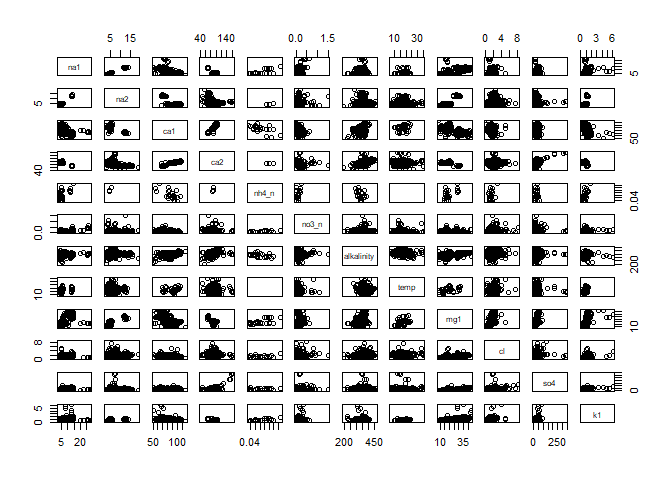
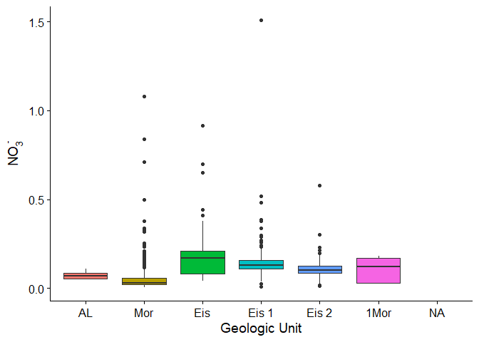
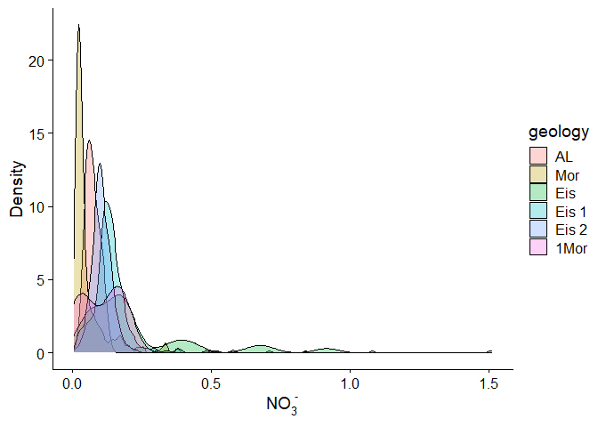

R Project: Konza Groundwater Analysis
================
Christopher Wheeler

## Prepare the R environment

We will load any relevant packages and set the default for our code
visibility in the final report.

``` r
knitr::opts_chunk$set(echo = TRUE)
library(zoo)
library(lubridate)
library(ggplot2)
library(plotly)
library(cowplot)
library(fs)
library(Rcpp)
library(sp)
library(raster)
library(rgdal)
library(rasterVis)
library(sf)
library(tidyverse)
library(dplyr)
library(dataRetrieval)
library(cowplot)
library(reshape2)
library(magrittr)
library(tidyr)
library(readxl)
library(janitor)
```

## Konza Praire LTER Overview

Konza Prairie Biological Station (Konza) was designated as a Long-term
Ecological Research Site (LTER) by NSF in 1981. In the 1990s, Dr. Gwen
Macpherson coordinated the installation of multiple wells in the N04D
watershed at Konza. All that historical groundwater data is accessible
via the Konza Long-term Ecological Research Site webpage. Data include
GWL measurements, as well as water quality data for many analytes This
data I am going to analyze come from one of the many subwatersheds known
as N04D. This watershed is grazed by bison for most of the year, and is
subject to a controlled burn very four years.Below is a map of the
entire site.

## Tidy, gap-fill, QAQC data

In this section, we will perform some basic data cleaning operations to
get our data ready for further analysis

``` r
# bring in and examine konza groundwater data set
kgw <- read_csv("kgw.csv", col_types = cols(WLDate = col_character()))
head(kgw)
```

    ## # A tibble: 6 x 36
    ##   DATACODE RECTYPE Location Trans  Plot Geology Recyear WLDate  Elevation SWDate
    ##   <chr>      <dbl> <chr>    <dbl> <dbl> <chr>     <dbl> <chr>   <chr>     <chr> 
    ## 1 AGW01          1 1-1AL        1     1 AL         1990 1990-0~ 364.47    na    
    ## 2 AGW01          1 2-1Mor       2     1 Mor        1990 1990-0~ 365.44    na    
    ## 3 AGW01          1 2-4Mor       2     4 Mor        1990 1990-0~ 365.28    na    
    ## 4 AGW01          1 2-5Mor       2     5 Mor        1990 1990-0~ 365.18    na    
    ## 5 AGW01          1 2-6Mor       2     6 Mor        1990 1990-0~ 365.26    na    
    ## 6 AGW01          1 3-3Eis       3     3 Eis        1990 1990-0~ 371.87    na    
    ## # ... with 26 more variables: Na1 <chr>, Na2 <chr>, K1 <chr>, K2 <chr>,
    ## #   Li <chr>, NH4_N <chr>, Ca1 <chr>, Ca2 <chr>, Mg1 <chr>, Mg2 <chr>,
    ## #   Sr <chr>, Ba <chr>, SO4 <chr>, F <chr>, Cl <chr>, NO3_N <chr>,
    ## #   HPO4_P <chr>, Alkalinity <chr>, pH1 <chr>, DDB <chr>, pH2 <chr>,
    ## #   Temp <chr>, Si1 <chr>, Si2 <chr>, B <chr>, Conduct <chr>

``` r
names(kgw)
```

    ##  [1] "DATACODE"   "RECTYPE"    "Location"   "Trans"      "Plot"      
    ##  [6] "Geology"    "Recyear"    "WLDate"     "Elevation"  "SWDate"    
    ## [11] "Na1"        "Na2"        "K1"         "K2"         "Li"        
    ## [16] "NH4_N"      "Ca1"        "Ca2"        "Mg1"        "Mg2"       
    ## [21] "Sr"         "Ba"         "SO4"        "F"          "Cl"        
    ## [26] "NO3_N"      "HPO4_P"     "Alkalinity" "pH1"        "DDB"       
    ## [31] "pH2"        "Temp"       "Si1"        "Si2"        "B"         
    ## [36] "Conduct"

``` r
summary(kgw)
```

    ##    DATACODE            RECTYPE    Location             Trans     
    ##  Length:7631        Min.   :1   Length:7631        Min.   :1.00  
    ##  Class :character   1st Qu.:1   Class :character   1st Qu.:2.00  
    ##  Mode  :character   Median :1   Mode  :character   Median :3.00  
    ##                     Mean   :1                      Mean   :2.89  
    ##                     3rd Qu.:1                      3rd Qu.:4.00  
    ##                     Max.   :1                      Max.   :4.00  
    ##                                                    NA's   :10    
    ##       Plot         Geology             Recyear        WLDate         
    ##  Min.   :1.000   Length:7631        Min.   :1990   Length:7631       
    ##  1st Qu.:2.000   Class :character   1st Qu.:2000   Class :character  
    ##  Median :4.000   Mode  :character   Median :2008   Mode  :character  
    ##  Mean   :4.018                      Mean   :2007                     
    ##  3rd Qu.:6.000                      3rd Qu.:2014                     
    ##  Max.   :7.000                      Max.   :2019                     
    ##  NA's   :10                                                          
    ##   Elevation            SWDate              Na1                Na2           
    ##  Length:7631        Length:7631        Length:7631        Length:7631       
    ##  Class :character   Class :character   Class :character   Class :character  
    ##  Mode  :character   Mode  :character   Mode  :character   Mode  :character  
    ##                                                                             
    ##                                                                             
    ##                                                                             
    ##                                                                             
    ##       K1                 K2                 Li               NH4_N          
    ##  Length:7631        Length:7631        Length:7631        Length:7631       
    ##  Class :character   Class :character   Class :character   Class :character  
    ##  Mode  :character   Mode  :character   Mode  :character   Mode  :character  
    ##                                                                             
    ##                                                                             
    ##                                                                             
    ##                                                                             
    ##      Ca1                Ca2                Mg1                Mg2           
    ##  Length:7631        Length:7631        Length:7631        Length:7631       
    ##  Class :character   Class :character   Class :character   Class :character  
    ##  Mode  :character   Mode  :character   Mode  :character   Mode  :character  
    ##                                                                             
    ##                                                                             
    ##                                                                             
    ##                                                                             
    ##       Sr                 Ba                SO4                 F            
    ##  Length:7631        Length:7631        Length:7631        Length:7631       
    ##  Class :character   Class :character   Class :character   Class :character  
    ##  Mode  :character   Mode  :character   Mode  :character   Mode  :character  
    ##                                                                             
    ##                                                                             
    ##                                                                             
    ##                                                                             
    ##       Cl               NO3_N              HPO4_P           Alkalinity       
    ##  Length:7631        Length:7631        Length:7631        Length:7631       
    ##  Class :character   Class :character   Class :character   Class :character  
    ##  Mode  :character   Mode  :character   Mode  :character   Mode  :character  
    ##                                                                             
    ##                                                                             
    ##                                                                             
    ##                                                                             
    ##      pH1                DDB                pH2                Temp          
    ##  Length:7631        Length:7631        Length:7631        Length:7631       
    ##  Class :character   Class :character   Class :character   Class :character  
    ##  Mode  :character   Mode  :character   Mode  :character   Mode  :character  
    ##                                                                             
    ##                                                                             
    ##                                                                             
    ##                                                                             
    ##      Si1                Si2                 B               Conduct         
    ##  Length:7631        Length:7631        Length:7631        Length:7631       
    ##  Class :character   Class :character   Class :character   Class :character  
    ##  Mode  :character   Mode  :character   Mode  :character   Mode  :character  
    ##                                                                             
    ##                                                                             
    ##                                                                             
    ## 

Below are some steps I used to tidy the raw data frame.

``` r
# from the summary, it appears that all of the actual chem data is in string format, so we need to convert to numeric
kgw[,11:ncol(kgw)]<- lapply(kgw[,11:ncol(kgw)], as.numeric)

#now convert date from character to proper format and clean up column names
kgw <- kgw %>% 
  mutate(date = lubridate::ymd(WLDate)) %>% 
  clean_names() %>% 
  dplyr::select(-wl_date)
  
# now look at data and col types again
summary(kgw)
```

    ##    datacode            rectype    location             trans     
    ##  Length:7631        Min.   :1   Length:7631        Min.   :1.00  
    ##  Class :character   1st Qu.:1   Class :character   1st Qu.:2.00  
    ##  Mode  :character   Median :1   Mode  :character   Median :3.00  
    ##                     Mean   :1                      Mean   :2.89  
    ##                     3rd Qu.:1                      3rd Qu.:4.00  
    ##                     Max.   :1                      Max.   :4.00  
    ##                                                    NA's   :10    
    ##       plot         geology             recyear      elevation        
    ##  Min.   :1.000   Length:7631        Min.   :1990   Length:7631       
    ##  1st Qu.:2.000   Class :character   1st Qu.:2000   Class :character  
    ##  Median :4.000   Mode  :character   Median :2008   Mode  :character  
    ##  Mean   :4.018                      Mean   :2007                     
    ##  3rd Qu.:6.000                      3rd Qu.:2014                     
    ##  Max.   :7.000                      Max.   :2019                     
    ##  NA's   :10                                                          
    ##    sw_date               na1              na2               k1       
    ##  Length:7631        Min.   : 2.060   Min.   : 2.360   Min.   :0.120  
    ##  Class :character   1st Qu.: 4.170   1st Qu.: 4.350   1st Qu.:0.680  
    ##  Mode  :character   Median : 4.840   Median : 5.080   Median :0.830  
    ##                     Mean   : 6.252   Mean   : 5.797   Mean   :0.923  
    ##                     3rd Qu.: 5.710   3rd Qu.: 6.428   3rd Qu.:1.070  
    ##                     Max.   :28.600   Max.   :19.000   Max.   :6.160  
    ##                     NA's   :7146     NA's   :6305     NA's   :7139   
    ##        k2             li            nh4_n            ca1        
    ##  Min.   :0.06   Min.   :0.002   Min.   :0.030   Min.   : 50.80  
    ##  1st Qu.:0.70   1st Qu.:0.014   1st Qu.:0.060   1st Qu.: 80.40  
    ##  Median :0.90   Median :0.021   Median :0.075   Median : 87.90  
    ##  Mean   :0.90   Mean   :0.022   Mean   :0.084   Mean   : 85.75  
    ##  3rd Qu.:1.08   3rd Qu.:0.029   3rd Qu.:0.110   3rd Qu.: 92.45  
    ##  Max.   :5.03   Max.   :0.053   Max.   :0.170   Max.   :117.00  
    ##  NA's   :6310   NA's   :6316    NA's   :7605    NA's   :7156    
    ##       ca2              mg1             mg2              sr       
    ##  Min.   : 42.80   Min.   : 8.56   Min.   : 7.90   Min.   :0.306  
    ##  1st Qu.: 84.30   1st Qu.:16.10   1st Qu.:17.80   1st Qu.:0.800  
    ##  Median : 90.80   Median :17.80   Median :20.00   Median :0.930  
    ##  Mean   : 89.85   Mean   :19.78   Mean   :21.17   Mean   :1.056  
    ##  3rd Qu.: 97.20   3rd Qu.:20.00   3rd Qu.:26.10   3rd Qu.:1.380  
    ##  Max.   :164.00   Max.   :43.10   Max.   :50.20   Max.   :7.390  
    ##  NA's   :6311     NA's   :7147    NA's   :6310    NA's   :6310   
    ##        ba             so4               f              cl       
    ##  Min.   :0.018   Min.   :  2.60   Min.   :0.00   Min.   :0.200  
    ##  1st Qu.:0.067   1st Qu.: 18.55   1st Qu.:0.37   1st Qu.:1.500  
    ##  Median :0.093   Median : 28.80   Median :0.43   Median :1.900  
    ##  Mean   :0.089   Mean   : 30.78   Mean   :0.46   Mean   :1.968  
    ##  3rd Qu.:0.105   3rd Qu.: 38.50   3rd Qu.:0.54   3rd Qu.:2.400  
    ##  Max.   :0.890   Max.   :338.00   Max.   :1.58   Max.   :8.300  
    ##  NA's   :6316    NA's   :5864     NA's   :6135   NA's   :5896   
    ##      no3_n           hpo4_p       alkalinity         p_h1            ddb       
    ##  Min.   :0.000   Min.   : NA    Min.   :193.0   Min.   :6.830   Min.   :7.340  
    ##  1st Qu.:0.028   1st Qu.: NA    1st Qu.:340.0   1st Qu.:7.580   1st Qu.:7.425  
    ##  Median :0.075   Median : NA    Median :354.0   Median :7.740   Median :7.770  
    ##  Mean   :0.095   Mean   :NaN    Mean   :355.2   Mean   :7.752   Mean   :7.683  
    ##  3rd Qu.:0.130   3rd Qu.: NA    3rd Qu.:371.0   3rd Qu.:7.940   3rd Qu.:7.845  
    ##  Max.   :1.510   Max.   : NA    Max.   :459.0   Max.   :8.390   Max.   :8.170  
    ##  NA's   :6485    NA's   :7631   NA's   :5887    NA's   :5890    NA's   :7580   
    ##       p_h2            temp            si1             si2        
    ##  Min.   :4.530   Min.   : 7.40   Min.   :4.260   Min.   : 0.010  
    ##  1st Qu.:7.060   1st Qu.:14.30   1st Qu.:5.210   1st Qu.: 4.960  
    ##  Median :7.220   Median :16.80   Median :5.760   Median : 5.700  
    ##  Mean   :7.255   Mean   :16.95   Mean   :5.817   Mean   : 5.707  
    ##  3rd Qu.:7.400   3rd Qu.:19.10   3rd Qu.:6.420   3rd Qu.: 6.330  
    ##  Max.   :8.340   Max.   :34.80   Max.   :7.160   Max.   :22.100  
    ##  NA's   :7133    NA's   :7148    NA's   :7506    NA's   :6314    
    ##        b            conduct            date           
    ##  Min.   :0.006   Min.   :  5.29   Min.   :1990-05-01  
    ##  1st Qu.:0.024   1st Qu.:422.75   1st Qu.:1996-07-23  
    ##  Median :0.033   Median :503.00   Median :2000-05-22  
    ##  Mean   :0.034   Mean   :491.42   Mean   :2000-04-07  
    ##  3rd Qu.:0.039   3rd Qu.:565.00   3rd Qu.:2004-02-28  
    ##  Max.   :0.181   Max.   :728.00   Max.   :2007-11-18  
    ##  NA's   :6311    NA's   :6955     NA's   :4140

Now that the data frame is cleaned up, I can start an exploratory
analysis. As we learned in class, a good first pass at this is to simply
create a cross plot of all the variables to check for any obvious
correlations. When I first tried using plot with the whole data frame, I
got an error saying that the margins were too large. I next tried to use
a subsetted data frame with just the chemistry

``` r
# subset original df to one with just chemical concentrations

all_na <- function(x) any(!is.na(x))

kgw_2 <- kgw %>% 
  select_if(all_na)

kgw_chem <- kgw_2 %>% 
  dplyr::select(-conduct, -date, -datacode, -rectype, -location, -trans, -plot, -geology, -recyear, -elevation, -sw_date)

names(kgw_chem)
```

    ##  [1] "na1"        "na2"        "k1"         "k2"         "li"        
    ##  [6] "nh4_n"      "ca1"        "ca2"        "mg1"        "mg2"       
    ## [11] "sr"         "ba"         "so4"        "f"          "cl"        
    ## [16] "no3_n"      "alkalinity" "p_h1"       "ddb"        "p_h2"      
    ## [21] "temp"       "si1"        "si2"        "b"

``` r
kgw_chem_subset <- kgw_chem %>% 
  dplyr::select(na1, na2, ca1, ca2, nh4_n, no3_n, alkalinity, temp, mg1, cl)
```

cross plot

``` r
plot(kgw_chem_subset)
```

<!-- --> From
this cross plot, a few correlations stand out to me a potentially
significant…

Additionally, as a first pass I want to look at differences among wells
screened in different geologic units. First I need to do some
subsetting.

``` r
kgw_2 <- kgw_2 %>% 
  mutate(geology = as_factor(geology))

kgw_geosub <- kgw_2[kgw_2$geology == 'AL' | kgw_2$geology == 'AL' | kgw_2$geology == 'Eis'   
                 | kgw_2$geology == 'Eis 1' | kgw_2$geology == 'Eis 2'  | kgw_2$geology == '1Mor'| kgw_2$geology == 'Mor', ]
```

Here is plot

``` r
ggplot(kgw_geosub, aes(x = factor(geology), y = no3_n, fill = geology)) + 
  geom_boxplot() + 
  theme_cowplot() + 
  xlab("Geologic Unit") + 
  theme(legend.position="none") + 
  ylab(bquote(NO[3]^" -")) 
```

<!-- -->
Below is density plot

``` r
ggplot(kgw_geosub, aes(no3_n, fill = geology)) + 
  geom_density(alpha = 0.3) + 
  theme_cowplot() + 
  xlab(bquote(NO[3]^" -")) + 
  ylab("Density")
```

    ## Warning: Removed 5218 rows containing non-finite values (stat_density).

<!-- -->
Below is a QQ plot for all observations of So4

Now bring in second data set with high frequency GWl measurements on
well subset

``` r
agw <- read_csv("agw.csv") %>% 
  rename(datetime = WLDate) %>% 
  mutate(datetime = lubridate::mdy_hms(datetime)) %>% 
  clean_names()
```

    ## 
    ## -- Column specification --------------------------------------------------------
    ## cols(
    ##   Datacode = col_character(),
    ##   Rectype = col_double(),
    ##   Recyear = col_double(),
    ##   WLDate = col_character(),
    ##   Wellname = col_character(),
    ##   WL = col_double(),
    ##   GWtemp = col_double(),
    ##   BLtemp = col_character(),
    ##   Comments = col_character()
    ## )

At the end I want three animated maps: gw levels, pulse storage, and
stics

``` r
#animated maps 
```

## Evaluation of Statistical Tests

Below is making a stats dataframe form the `kgw_chem` numeric data frame

``` r
# start data frame with column of means
stat_kgw <- data.frame(colMeans(kgw_chem,na.rm=TRUE))

# rename column
stat_kgw <- stat_kgw %>% 
  rename(mean = names(stat_kgw))

# add median
stat_kgw$median<-sapply(kgw_chem, function(med)  meds = median(med,na.rm=TRUE))

# add standard deviations
stat_kgw$sd<-sapply(kgw_chem, function(std)  sds = sd(std,na.rm=TRUE))

# add variance
stat_kgw$var<-sapply(kgw_chem, function(vr)  vars = var(vr,na.rm=TRUE))

# transpose such that stats are row names and analytes are cols
stat_kgw_mx <- as.matrix(stat_kgw)
stat_kgw_mx <- t(stat_kgw_mx)
stat_kgw <- as.data.frame(stat_kgw_mx)

stat_kgw
```

    ##              na1      na2        k1         k2           li       nh4_n
    ## mean    6.251794 5.796538 0.9232520 0.89980242 2.221749e-02 0.084230769
    ## median  4.840000 5.080000 0.8300000 0.90000000 2.100000e-02 0.075000000
    ## sd      3.879375 2.384605 0.5073806 0.29195558 9.935170e-03 0.036019226
    ## var    15.049550 5.686340 0.2574350 0.08523806 9.870761e-05 0.001297385
    ##              ca1       ca2       mg1       mg2        sr          ba       so4
    ## mean    85.75389  89.84977 19.778905 21.174201 1.0563422 0.088777186  30.77779
    ## median  87.90000  90.80000 17.800000 20.000000 0.9300000 0.093000000  28.80000
    ## sd      10.47690  11.93762  6.947848  4.834154 0.4542451 0.032495986  20.11607
    ## var    109.76540 142.50673 48.272595 23.369046 0.2063386 0.001055989 404.65611
    ##                 f        cl      no3_n alkalinity       p_h1        ddb
    ## mean   0.45954880 1.9682248 0.09545375   355.1662 7.75183802 7.68313725
    ## median 0.43000000 1.9000000 0.07500000   354.0000 7.74000000 7.77000000
    ## sd     0.14896865 0.7378180 0.10775383    26.3352 0.24604190 0.22591583
    ## var    0.02219166 0.5443754 0.01161089   693.5430 0.06053662 0.05103796
    ##             p_h2      temp       si1      si2            b
    ## mean   7.2552209 16.946998 5.8174400 5.706743 0.0335204545
    ## median 7.2200000 16.800000 5.7600000 5.700000 0.0330000000
    ## sd     0.3756583  4.199704 0.7167837 1.236166 0.0129828559
    ## var    0.1411192 17.637517 0.5137789 1.528107 0.0001685545

We can draw a few basic conclusions from the stats we have just
generated. One is that for all analytes except ba, the median values are
smaller than the mean values. This indicates a right skewed or positive
skewed distribution. This is very common with environmental data, and
water quality data in particular.
